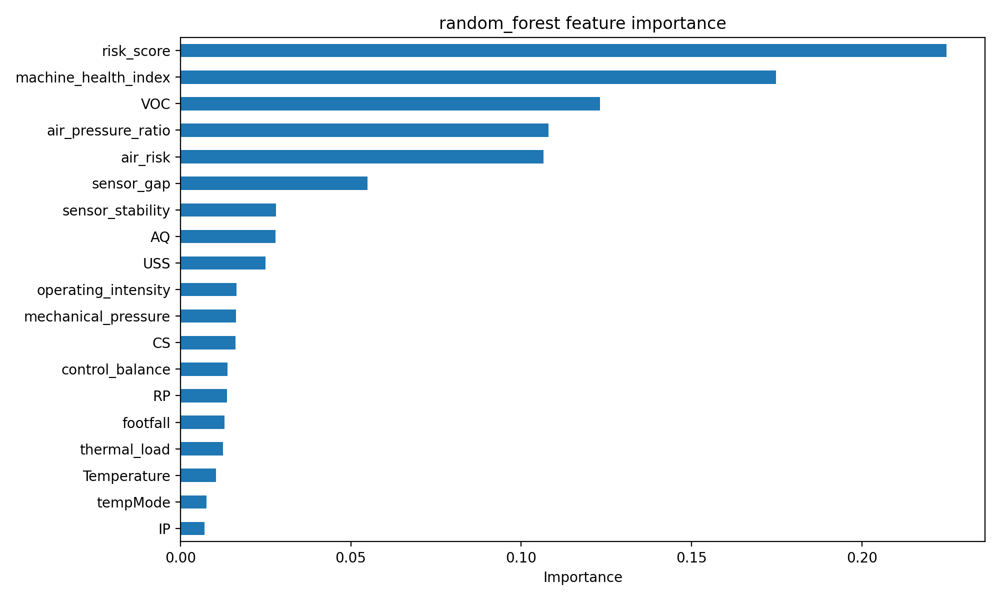
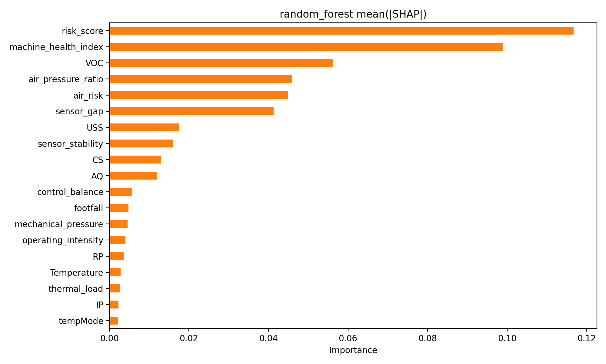

# Memoria técnica del Trabajo Fin de Máster

## 1. Resumen ejecutivo

Este Trabajo Fin de Máster desarrolla una solución de mantenimiento predictivo para maquinaria industrial a partir de datos de sensores. El objetivo es anticipar fallos, detectar señales de riesgo y apoyar la toma de decisiones con una visión clara para perfiles técnicos y de negocio.

La solución integra análisis exploratorio, limpieza de datos, ingeniería de características, detección de anomalías, modelos supervisados, explicabilidad y un dashboard orientado a la dirección y mantenimiento.

## 2. Objetivo del proyecto

El propósito principal es transformar lecturas de sensores en información útil para actuar antes de que ocurra un fallo.

En términos prácticos, el proyecto busca:

- identificar comportamientos anómalos;
- estimar el riesgo de fallo;
- comparar varios modelos predictivos;
- explicar qué señales influyen más en la decisión;
- mostrar el resultado de forma visual y comprensible.

## 3. Datos utilizados

El dataset contiene 944 registros con señales industriales como `footfall`, `tempMode`, `AQ`, `USS`, `CS`, `VOC`, `RP`, `IP`, `Temperature` y la variable objetivo `fail`.

La lectura de negocio es sencilla: cada fila representa una condición de operación de la máquina y la etiqueta indica si ese estado terminó en fallo o no. El reto consiste en reconocer patrones previos al fallo y no solo clasificar un caso ya cerrado.

## 4. Qué reveló el análisis inicial

El análisis exploratorio mostró una base de datos completa y coherente:

- 944 registros originales;
- 0 valores nulos;
- 1 duplicado eliminado;
- distribución de clases razonablemente equilibrada.

La variable objetivo presenta:

- clase 0: 551 registros, 58.37%;
- clase 1: 393 registros, 41.63%.

Esto significa que el problema no está condicionado por falta de datos, sino por la necesidad de capturar señal útil dentro de las variables de sensores.

## 5. Preparación de los datos

La preparación se centró en asegurar una base limpia y reproducible:

- eliminación del duplicado;
- separación estratificada en train y test;
- uso de un preprocesamiento consistente.

La proporción de fallos se mantuvo estable entre subconjuntos, lo que da confianza en la comparación posterior de modelos.

## 6. Ingeniería de características

Se crearon 11 variables derivadas para resumir mejor el estado operativo del equipo. Entre las más relevantes destacan `risk_score`, `machine_health_index`, `air_pressure_ratio`, `air_risk` y `sensor_gap`.

La idea es simple: en lugar de depender solo de sensores aislados, se construyen indicadores más cercanos al lenguaje operativo del mantenimiento. Esto mejora la capacidad del modelo para detectar degradación y también hace la solución más fácil de interpretar.

## 7. Detección de anomalías

Se probaron dos enfoques no supervisados:

- Isolation Forest;
- Local Outlier Factor (LOF).

### Imagen de referencia

Los resultados de anomalías fueron modestos frente al modelo supervisado, pero útiles como capa complementaria. En un contexto industrial, una anomalía no equivale necesariamente a fallo, pero sí a una situación que conviene vigilar.

## 8. Predicción de fallos

Se compararon tres modelos:

- Random Forest;
- XGBoost;
- LightGBM.

El mejor resultado lo obtuvo **Random Forest**, con `F1 = 0.9157` y `ROC-AUC = 0.9732` en test.

La lectura ejecutiva es clara: el modelo distingue bien entre estados normales y estados de riesgo, y además detecta un porcentaje muy alto de fallos, que es precisamente lo más valioso para mantenimiento.

## 9. Interpretación del resultado

Las variables más influyentes fueron `risk_score`, `machine_health_index`, `VOC`, `air_pressure_ratio`, `air_risk` y `sensor_gap`.

Esto confirma dos ideas importantes:

- las variables derivadas aportan más valor que los sensores tomados de forma aislada;
- el sistema está capturando una señal operativa coherente con la degradación de la máquina.

## 10. Dashboard

Se construyó un dashboard con Streamlit para mostrar el resultado de forma ejecutiva.

La interfaz prioriza:

- el riesgo estimado;
- el modelo recomendado;
- las señales que más pesan;
- las anomalías detectadas;
- la salud global de la máquina.

La información técnica completa queda disponible, pero no domina la primera lectura del panel.

### Capturas del dashboard

Vista ejecutiva principal del dashboard:

Vista complementaria con detalle operativo:

## 11. Conclusión general

La solución desarrollada cumple el objetivo principal del TFM: convertir datos de sensores en una herramienta práctica para anticipar fallos y apoyar decisiones de mantenimiento.

El punto más sólido del proyecto es la combinación de ingeniería de características, modelado supervisado e interpretabilidad. Esa combinación permite no solo predecir bien, sino explicar por qué el modelo toma cada decisión.

## 12. Líneas de mejora

Como evolución futura, sería recomendable:

- ampliar el volumen de datos históricos;
- incorporar la dimensión temporal;
- ajustar umbrales según criticidad del activo;
- añadir alertas automáticas;
- desplegar una API o un sistema de monitorización en producción.
